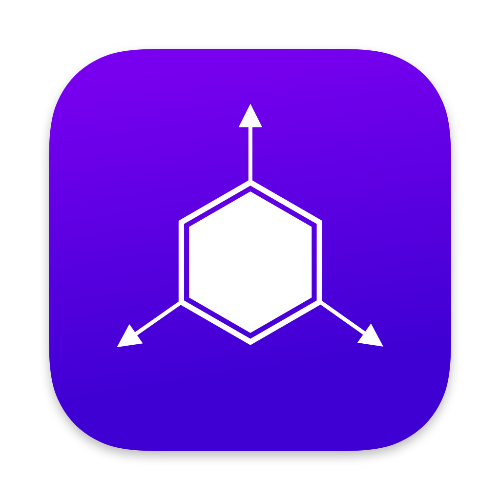

# Absolute Solver

A file manager that will modify/delete files By Any Means Necessary™

Usage:
```swift
import AbsoluteSolver

// Replace file with data
AbsoluteSolver.replace(at: URL, with: NSData)

// Delete file
AbsoluteSolver.delete(at: URL)

// Copy file
AbsoluteSolver.copy(at: URL, to: URL)

// Read data from file (returns Data)
AbsoluteSolver.readFile(path: String)

// Delete contents of directory (but not directory itself)
AbsoluteSolver.delDirectoryContents(path: String, progress: ((Double, String)) -> ())

// Plist Padding (returns Data)
AbsoluteSolver.padPlist(replacementData: Data, filePath: String)
```
